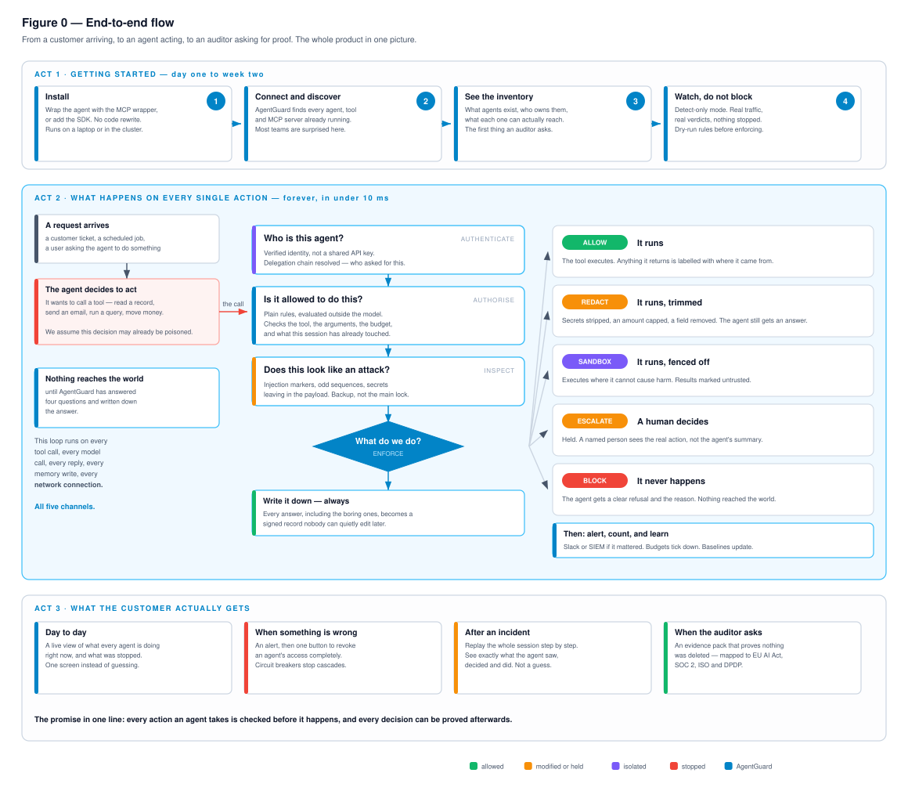
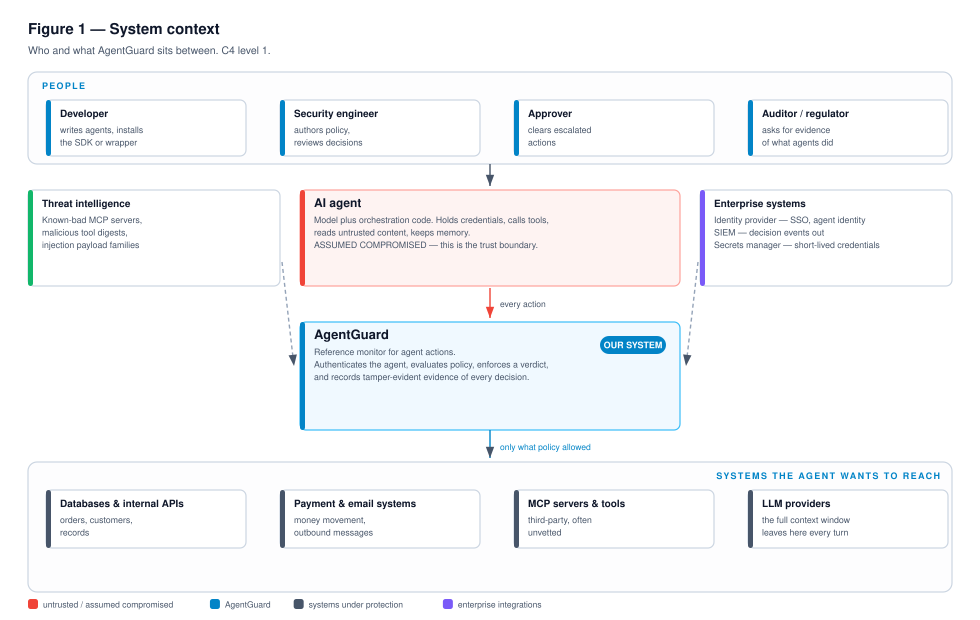
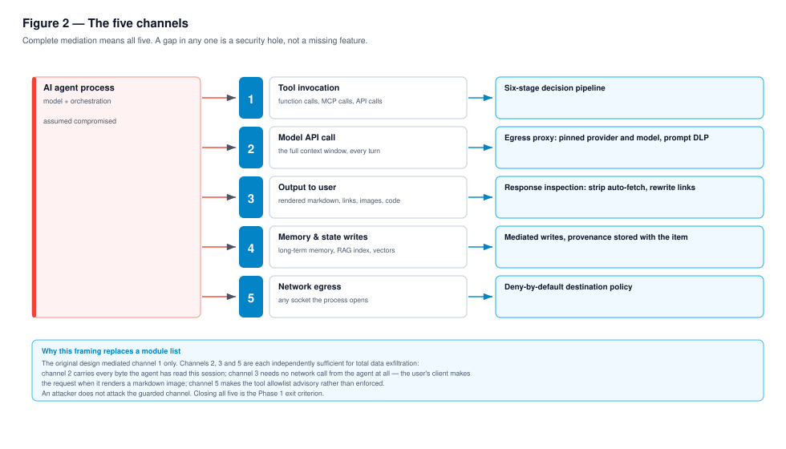
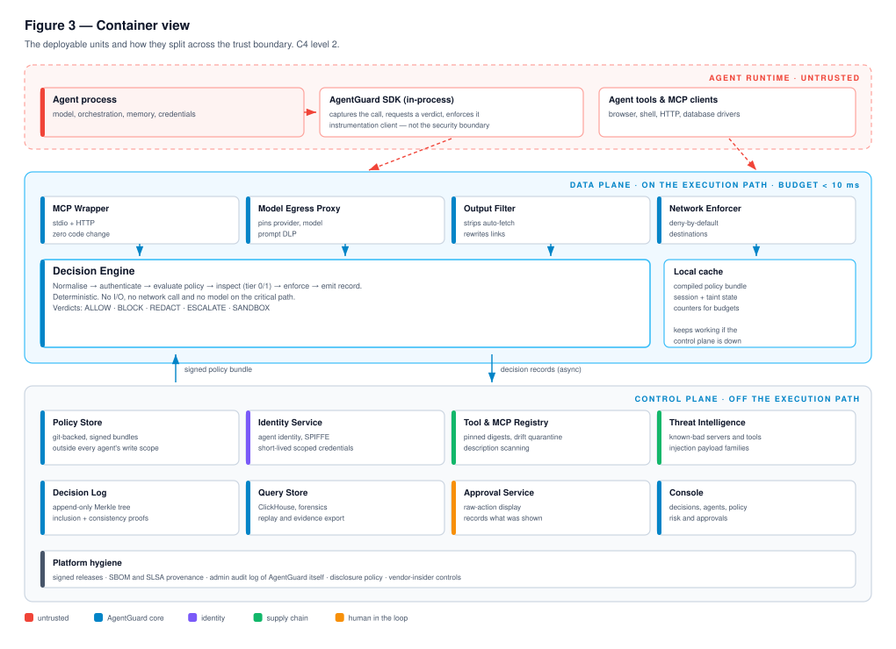
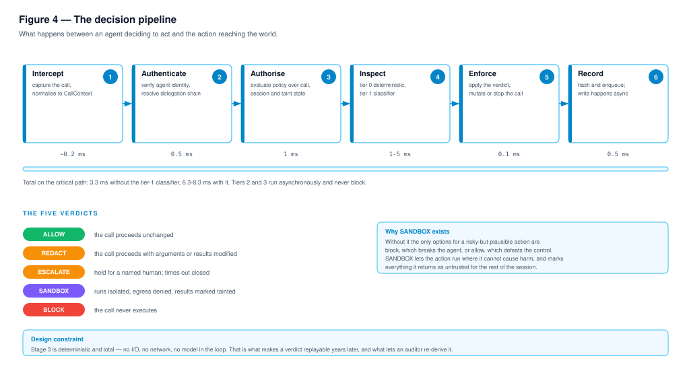
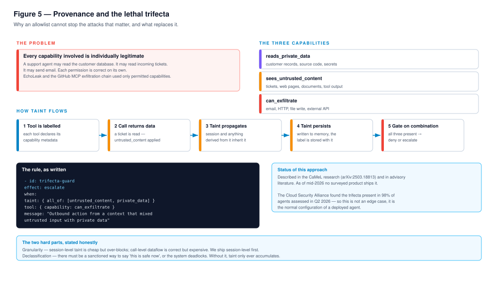
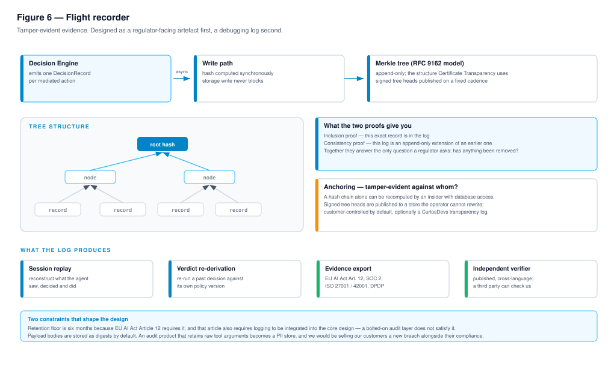
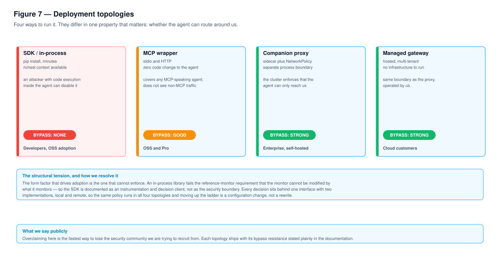
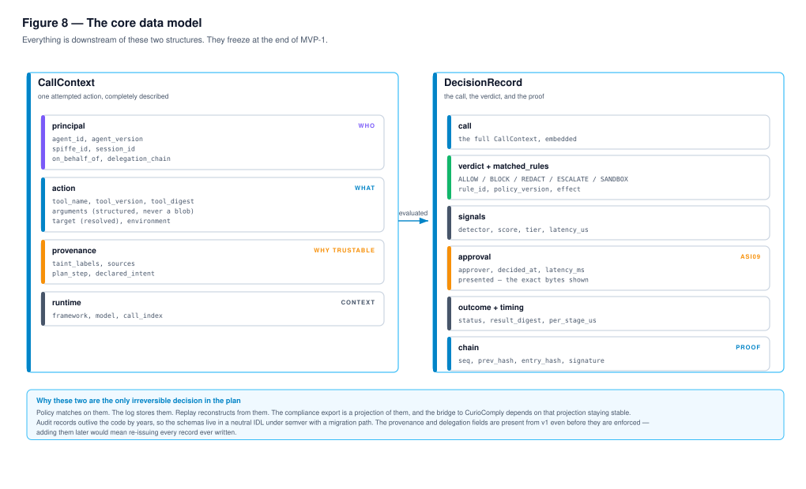

# AgentGuard — High-Level Design

**Version** 1.1 · **Date** 1 Aug 2026 · **Audience** engineering, architecture review
**Scope of record** Product Definition & Build Plan v2.0 (*what* and *when*) · Technical Product Specification v1.1 (*why*)
**This document** *how the system is put together* — structure, boundaries, flows and the reasoning behind each.
**Status** Design baseline for MVP-0 and MVP-1. Component-level detail is deferred to the LLD.

---

## Contents

1. [Purpose and scope](#1-purpose-and-scope)
2. [Design principles](#2-design-principles)
3. [System context](#3-system-context)
4. [The five channels](#4-the-five-channels)
5. [Container view](#5-container-view)
6. [The decision pipeline](#6-the-decision-pipeline)
7. [Provenance and policy](#7-provenance-and-policy)
8. [Evidence subsystem](#8-evidence-subsystem)
9. [Identity subsystem](#9-identity-subsystem)
10. [Supply-chain subsystem](#10-supply-chain-subsystem)
11. [Deployment topologies](#11-deployment-topologies)
12. [Data model](#12-data-model)
13. [Cross-cutting concerns](#13-cross-cutting-concerns)
14. [Technology choices](#14-technology-choices)
15. [Out of scope for this HLD](#15-out-of-scope-for-this-hld)
16. [Traceability](#16-traceability)

---

## 1. Purpose and scope

This document describes the structure of AgentGuard at a level sufficient to begin implementation: what the deployable units are, where the trust boundaries fall, how a request flows through the system, and which properties every component must preserve.

It is deliberately a *high-level* design. It fixes structure and contracts. It does not fix class layouts, function signatures, database schemas beyond the two canonical event structures, or algorithm choices inside a component — those belong in the Low-Level Design that follows.

### The system in one sentence

> AgentGuard is a **reference monitor for AI agent actions**. It assumes the model is compromised, mediates every channel through which an agent can affect the world, and produces tamper-evident evidence of every decision.

### The whole thing at a glance

Before the formal views, one picture of the entire product: a customer arriving, an agent acting, and an auditor asking for proof.

Read it in three acts. **Act 1** is onboarding — install, discover what is already running, see the inventory, and watch in detect-only mode before blocking anything. **Act 2** is the loop that then runs forever: four questions asked of every action, a verdict, and a record written whether the answer was interesting or not. **Act 3** is what the customer actually gets out of it — a live view, a kill switch, incident replay, and evidence a regulator will accept.

Everything else in this document is a more precise view of Act 2.

### What "reference monitor" commits us to

The term is not decorative. It carries three classical requirements (Anderson, 1972), and each one constrains the architecture in a specific, testable way.

| Requirement | Architectural consequence |
|---|---|
| **Complete mediation** | Every one of the five channels in §4 has a mediating container. A channel without one is a design defect, not a backlog item. |
| **Tamper-proof** | The monitor's code, policy and logs must sit outside anything the agent can write to. This is why the SDK is not the security boundary (§11) and why the policy store is outside every agent's write scope. |
| **Verifiable** | The decision path is deterministic and small. No I/O, no network call and no model inference on the critical path (§6). |

---

## 2. Design principles

Seven principles. Where a later section makes a choice that looks odd, it is usually one of these being applied.

**P1 — Assume the model is compromised.** No control may depend on the model behaving correctly, on prompt instructions being followed, or on the agent's own reasoning being sound. Controls are evaluated in ordinary deterministic code outside the model.

**P2 — Mediate channels, not modules.** The architecture is organised around the five ways an agent affects the world. Modules (identity, policy, detection, evidence, supply chain) are how we build; channels are how we check we are complete.

**P3 — Deterministic core, statistical periphery.** Policy evaluation is total and deterministic so that a verdict can be re-derived years later. Detection is defence in depth and never the primary control, because adaptive adversaries defeat statistical detectors.

**P4 — The evidence is a product, not a byproduct.** The decision record is designed as a regulator-facing artefact first and a debugging log second. This is what enterprises cannot build themselves, and it is the technical bridge to CurioComply.

**P5 — Fail in a stated direction.** Every rule declares its failure mode. Destructive and financial operations fail closed; read-only operations may fail open. A global switch would let an attacker choose the failure by attacking availability.

**P6 — The platform is a target.** Our SDK will run inside thousands of agent processes holding production credentials. Compromising us compromises all of them at once. Self-protection is a first-class design concern, not an operational afterthought.

**P7 — Do not overclaim.** Each deployment topology publishes its real bypass resistance. Residual risks are published rather than hidden. The audience we need to recruit — security researchers — will find the gap and judge us on whether we named it first.

---

## 3. System context

AgentGuard sits between an AI agent and everything the agent can reach. The agent is **inside** the untrusted zone: its model, its orchestration code, its memory and its context window are all assumed to be under adversary influence.

### External actors

| Actor | Interaction |
|---|---|
| **Developer** | installs the SDK or points traffic at the wrapper; writes and tests policy locally |
| **Security engineer** | authors policy, reviews decisions, tunes detection, investigates incidents |
| **Approver** | clears escalated actions; a named human, not a role account |
| **Auditor / regulator** | consumes evidence exports and verifies log integrity independently |

### External systems

| System | Relationship |
|---|---|
| Databases, internal APIs, payment and email systems | protected resources — reached only through a verdict |
| MCP servers and tools | both a protected resource *and* an untrusted input source, because tool descriptions enter the context window as trusted text |
| LLM providers | the destination of channel 2; receives the full context window every turn |
| Identity provider, SIEM, secrets manager | enterprise integrations |
| Threat intelligence | inbound feed of known-bad servers, tool digests and payload families |

---

## 4. The five channels

This is the completeness model for the whole system. An agent can affect the world in exactly five ways, and each has a mediating container.

| # | Channel | Mediating container | Why it cannot be skipped |
|---|---|---|---|
| 1 | Tool invocation | Decision Engine, via SDK or MCP Wrapper | the obvious path; the one everyone builds |
| 2 | Model API call | Model Egress Proxy | carries every byte the agent has read this session; an endpoint swap exfiltrates everything with **zero tool calls** |
| 3 | Output to user | Output Filter | needs no network activity from the agent at all — the *client* fetches a markdown image reference when it renders |
| 4 | Memory and state writes | Write mediation on memory and index paths | delayed activation; a poisoned write is executed in a later session that looks clean |
| 5 | Network egress | Network Enforcer | without it the tool allowlist is advisory rather than enforced |

**Design rule.** A feature that improves depth on channel 1 is worth less than a feature that closes channel 2, 3 or 5, because an attacker attacks the unguarded channel rather than the guarded one. This rule governs Phase 1 sequencing.

---

## 5. Container view

### 5.1 Plane separation

The system splits into two planes with different latency, availability and trust characteristics.

| | Data plane | Control plane |
|---|---|---|
| Position | on the execution path | off the execution path |
| Latency budget | < 10 ms p99 added | no hard budget |
| Availability requirement | must survive control-plane outage | may be down briefly |
| Contains | interceptors, Decision Engine, local cache | policy store, identity, registries, log, console |

The separation exists so a verdict can be produced **without a network round trip in the common case**: policy is compiled and pushed as a signed bundle, and decision records are written asynchronously.

### 5.2 Data-plane containers

| Container | Responsibility | Notes |
|---|---|---|
| **MCP Wrapper** | intercepts MCP traffic over stdio and HTTP | highest-leverage form factor — covers any MCP-speaking agent with zero code change, and is the only place Module E's best controls can live |
| **Model Egress Proxy** | pins allowed providers, endpoints and models per agent; applies prompt DLP; records a per-turn context digest | closes channel 2 |
| **Output Filter** | inspects the agent's response before any renderer sees it; strips auto-fetching elements, rewrites links, flags generated code | closes channel 3 |
| **Network Enforcer** | deny-by-default destination policy; mediated DNS resolution | closes channel 5; enforced by container networking, not cooperation |
| **Decision Engine** | the six stages; produces a verdict and a record | deterministic; no I/O, no model |
| **Local cache** | compiled policy bundle, session and taint state, budget counters | what makes degraded-but-enforcing mode possible |

### 5.3 Control-plane containers

| Container | Responsibility |
|---|---|
| **Policy Store** | git-backed source of truth; compiles and signs bundles; enforces two-person review. **Outside every agent's write scope** — otherwise a coding agent can edit the rules that govern it |
| **Identity Service** | agent identity, SPIFFE integration, short-lived scoped credential issuance, delegation chains |
| **Tool & MCP Registry** | pinned digests, drift detection and quarantine, description scanning, namespace enforcement |
| **Threat Intelligence** | ingests and distributes indicators; the only component with compounding cross-customer value |
| **Decision Log** | append-only Merkle tree with inclusion and consistency proofs |
| **Query Store** | analytical store for forensics, replay and evidence export |
| **Approval Service** | escalation queue; renders the raw action; records exactly what was shown |
| **Console** | operator surface over all of the above |
| **Platform hygiene** | signed releases, SBOM and provenance, our own admin audit log, vendor-insider controls |

### 5.4 Inter-plane contracts

Two flows cross the boundary, both one-directional and both asynchronous with respect to a verdict:

- **Control → data:** signed policy bundles, tool digests, identity material, detector models. The data plane rejects any bundle whose signature chain does not verify.
- **Data → control:** decision records, telemetry, approval requests. Buffered; a slow or absent control plane must not add latency to a verdict.

---

## 6. The decision pipeline

### 6.1 Stages

| # | Stage | Input | Output | Budget (p99) |
|---|---|---|---|---|
| 1 | Intercept | framework-specific call | normalised `CallContext` | ~0.2 ms |
| 2 | Authenticate | `CallContext.principal` | verified principal + delegation chain | 0.5 ms |
| 3 | Authorise | context + policy bundle + session/taint state | verdict + matched rule IDs | 1 ms |
| 4 | Inspect | payloads | risk signals with scores | 1–5 ms |
| 5 | Enforce | verdict | allow, mutate, isolate, hold or stop | 0.1 ms |
| 6 | Record | full decision | hash computed; write enqueued | 0.5 ms |

Total on the critical path: **3.3 ms** without the tier-1 classifier, **6.3–8.3 ms** with it. Tiers 2 and 3 run asynchronously and never block.

### 6.2 Verdicts

| Verdict | Meaning |
|---|---|
| `ALLOW` | the call proceeds unchanged |
| `REDACT` | the call proceeds with arguments or results modified |
| `ESCALATE` | held for a named human; times out **closed** |
| `SANDBOX` | runs isolated with egress denied; everything it returns is marked tainted |
| `BLOCK` | the call never executes |

`SANDBOX` exists because without it the only options for a risky-but-plausible action are block, which breaks the agent, and allow, which defeats the control.

### 6.3 Normalisation is the hard part

Stage 1 looks trivial and is not. Producing a *lossless, framework-independent* `CallContext` from LangChain, CrewAI, the OpenAI Agents SDK and raw MCP — including the provenance of the data that led to the call — is where most of the integration effort lives. Interception itself is straightforward; normalisation quality determines whether replay, drift detection and taint tracking work at all.

---

## 7. Provenance and policy

### 7.1 Why allowlists are insufficient

The attacks that matter use only permitted capabilities. A support agent legitimately reads the customer database, legitimately reads incoming tickets, and legitimately sends email. Each permission is correct in isolation; the combination is an exfiltration primitive. EchoLeak and the GitHub MCP chain both operated entirely within granted permissions.

### 7.2 The construction

1. **Label tools** with capability metadata: `reads_private_data`, `sees_untrusted_content`, `can_exfiltrate`.
2. **Propagate taint** through the session, and — critically — **through persistence**, so writing to memory and reading it back next session does not launder the label.
3. **Gate on the combination**, not on any single capability.

### 7.3 Policy engine properties

| Property | Commitment |
|---|---|
| Default | deny |
| Conflict resolution | explicit deny overrides any allow; order-independent |
| Evaluation | total — no unbounded loops, no I/O, no network |
| Determinism | same `CallContext` + same policy version ⇒ same verdict, permanently |
| Surface | restricted declarative YAML compiling to analysable (Cedar-style) semantics |

Determinism is not a performance choice. It is what makes replay meaningful, dry-run trustworthy, and an auditor's re-derivation possible.

### 7.4 Rule dimensions

Tools · typed argument constraints on structured arguments · rate limits · cumulative budgets · time windows · environment (`dev`/`staging`/`prod`) · data classification · **sequence** · **provenance**.

### 7.5 Dry-run

Policy changes are evaluated against recorded traffic before enforcement — *"this rule would have blocked 412 calls last week, here are 20 samples."* Only possible because of §7.3, and the single feature most likely to make an enterprise trust enforcement mode.

---

## 8. Evidence subsystem

### 8.1 Structure

A **Merkle tree following the RFC 9162 model**, not a bare hash chain. The two proofs it provides are exactly the two questions asked in an audit:

- **Inclusion proof** — this exact record is in the log.
- **Consistency proof** — this log is an append-only extension of the earlier one.

### 8.2 Tamper-evident against whom

A hash chain detects modification only if the verifier holds a trusted earlier root. An insider with write access to the store can recompute the entire chain. Therefore signed tree heads are published to a location the operator cannot rewrite — customer-controlled by default, optionally a CuriosDevs transparency log.

### 8.3 Outputs

Session replay · verdict re-derivation · evidence export mapped to control frameworks · a **published, cross-language independent verifier** so a third party can check us without trusting us.

### 8.4 Two constraints that shape it

**Retention floor is six months** because EU AI Act Article 12 requires it — and that article also requires logging to be *integrated into the core design*, which is why this is a first-class subsystem rather than a logging library.

**Payload bodies are stored as digests by default.** An audit product that retains raw tool arguments becomes a PII store; we would be selling customers a new breach alongside their compliance.

---

## 9. Identity subsystem

### 9.1 The problem

Agents authenticate with a human's credentials, a shared service account, or a long-lived unscoped token. Actions become unattributable, compromise becomes unrevocable without collateral damage, and the blast radius of any hijack equals the union of every permission the token carries.

### 9.2 Construction

We adopt the CNCF 2026 position rather than inventing a scheme: **SPIFFE for identity, OAuth 2.0 for delegation, policy-as-code for authorisation.**

| Concern | Mechanism |
|---|---|
| Workload identity | SPIFFE/SPIRE — short-lived, auto-rotated SVIDs; no standing credentials |
| Delegation from a human | RFC 8693 token exchange with the `act` claim, preserving the chain |
| Per-call scoping | credentials minted per task, scoped to the policy-derived capability set |
| Attribution | resolved principal and full delegation chain on every record |

### 9.3 What is agent-specific and therefore ours

- **Logical vs runtime identity.** Ten replicas share a logical identity and a permission budget but have distinct SVIDs. Policy is written against the logical identity; forensics needs the runtime one.
- **Version sensitivity.** `agent_version` — a hash of system prompt, tool set and config — participates in identity, because a prompt change is a behaviour change.
- **Capability budgets.** "May refund up to ₹50,000 cumulative per day" requires durable shared state on the hot path. This is a real cost, accepted deliberately for budget rules only.
- **Capability tokens.** Verdicts bind to *resolved* identifiers and the enforcement point issues a token for the resolved resource. This structurally removes the time-of-check/time-of-use and parser-differential attack classes rather than detecting them.

---

## 10. Supply-chain subsystem

### 10.1 The structural issue

Tool descriptions enter the context window **as trusted instruction text**, and SAST/SCA never read them — they are metadata, not code. That blind spot is this subsystem's reason to exist.

### 10.2 Controls

| # | Control | Defends against |
|---|---|---|
| 1 | Pin and digest the full tool definition on approval | baseline for everything below |
| 2 | Drift detection and quarantine on any digest change | rug pull — the entire defence, and it is cheap |
| 3 | Description scanning as untrusted content before it reaches a context | tool poisoning |
| 4 | Namespace enforcement bound to a verified server identity | tool shadowing |
| 5 | Continuous discovery across repos, dev machines, CI and production | shadow MCP servers |
| 6 | Deny-by-default egress for local MCP servers | blast radius after a successful injection |

Controls 1–4 live in the **MCP Wrapper**, which is the strongest argument for prioritising that form factor.

---

## 11. Deployment topologies

| Topology | Boundary | Bypass resistance | Audience |
|---|---|---|---|
| SDK, in-process | none — process-internal | **none** | developers, OSS adoption |
| MCP Wrapper | protocol | good | OSS and Pro |
| Companion proxy + NetworkPolicy | network | strong | enterprise, self-hosted |
| Managed gateway | network | strong | cloud |

### The structural tension

**The form factor that drives adoption is the one that cannot enforce.** An in-process library fails the tamper-proof requirement: code execution inside the agent can disable it, rewrite its policy, or suppress its logs.

**Resolution.** The SDK ships and is documented as an *instrumentation and decision client*, not as the security boundary. Every decision sits behind one `DecisionClient` interface with two implementations — local and remote — from day one. The same policy therefore runs in all four topologies, and moving up the ladder is a configuration change rather than a rewrite. Designing this seam late would mean a Phase 2 rewrite.

---

## 12. Data model

Two structures. Policy matches on them, the log stores them, replay reconstructs from them, and the compliance export is a projection of them.

### `CallContext` — one attempted action

| Group | Carries |
|---|---|
| `principal` | agent_id, agent_version, spiffe_id, session_id, on_behalf_of, delegation_chain |
| `action` | tool_name, tool_version, tool_digest, **structured** arguments, resolved target, environment |
| `provenance` | taint_labels, sources, plan_step, declared_intent |
| `runtime` | framework, model, call_index |

Arguments are **structured, never stringified** — policy must reason about `args.amount`, not regex a blob.

### `DecisionRecord` — the call, the verdict, the proof

| Group | Carries |
|---|---|
| `call` | the full `CallContext`, embedded |
| `verdict` + `matched_rules` | the outcome and which rule produced it, with policy version |
| `signals` | detector, score, tier, latency |
| `approval` | approver, timing, and **`presented`** — the exact bytes shown to the human |
| `outcome` + `timing` | execution status, result digest, per-stage timing |
| `chain` | seq, prev_hash, entry_hash, signature |

`approval.presented` is not incidental. It is the technical answer to OWASP ASI09: if what was displayed and what was executed ever diverge, that is detectable after the fact.

### Governance

Defined in a neutral IDL, versioned under semver with a migration path, with `provenance` and delegation fields present from v1 **even before they are enforced**. Audit records outlive the code by years; adding a field later would mean re-issuing every record ever written. This is the one decision in the programme that cannot be iterated out.

---

## 13. Cross-cutting concerns

### 13.1 Performance

"Sub-10 ms" means **p99 added latency measured at the interception point, excluding the tool's own execution and excluding tier-2/3 detection**, regression-tested in CI. An undefined performance claim is a liability in front of a technical buyer.

Two costs the budget hides: cumulative budgets and taint propagation both need **durable shared state**, which is a network round trip. Accepted for budget and taint rules only. Perspective: LLM inference dominates every agent request by two to three orders of magnitude, so a well-isolated out-of-process proxy costing 1–5 ms is not a reason to choose an in-process SDK.

### 13.2 Failure modes

| Concern | Design |
|---|---|
| Control-plane unavailable | data plane continues from local cache in degraded-but-enforcing mode |
| Fail direction | per-rule property; destructive and financial fail closed, read-only may fail open |
| Rogue agent | kill switch — revoke identity, invalidate credentials, drain in flight, sub-second, exercisable on demand |
| Cascade | circuit breakers on rate, error-rate and tool-mix deviation; blast-radius budgets |

### 13.3 Self-protection

Policy store write-access separated from agent runtime credentials · log signing key unreachable from the data plane · signed policy and detector updates · pinned dependencies, SBOM and reproducible builds · published threat model · vendor-insider controls on the managed log.

### 13.4 Multi-tenancy

For the managed gateway: no shared policy bundles, no shared classifier caches, no shared tree. The isolation model is documented and tested, because a cross-tenant finding ends an enterprise evaluation immediately.

### 13.5 Observability

Decision records are the primary telemetry. Standard metrics, traces and logs are emitted alongside and exported to the customer's existing stack in OCSF or ECS. We do not build an observability product.

---

## 14. Technology choices

| Layer | Choice | Rationale |
|---|---|---|
| Decision engine | Python first, Rust fast path deferred to Phase 3 | rewrite the fast path once the slow path is correct, never before |
| SDKs | Python, then TypeScript | where the agent ecosystem is |
| Interception | MCP wrapper (stdio + HTTP), framework adapters | zero-code-change adoption |
| Policy | restricted YAML → Cedar-style analysable semantics | dry-run and conflict detection depend on analysability |
| Identity | SPIFFE/SPIRE + RFC 8693 | adopt the standard rather than invent one |
| Decision log | Merkle tree, RFC 9162 model | standardised, well-analysed, gives the two proofs that matter |
| Query store | ClickHouse | billions of events, analytical forensics |
| Detection | small self-hosted classifiers | millisecond inference; no data leaves the customer boundary |
| Console | React with a shared component library | one design system across products |
| Isolation | compose with existing sandboxes | we gate `exec`-class tools; we do not become a container runtime |

---

## 15. Out of scope for this HLD

Deferred to the Low-Level Design: policy grammar and evaluation algorithm · `CallContext` normalisation per framework · Merkle batching, checkpointing and storage layout · classifier architecture and training data · console information architecture and screens · API contracts between containers · database schemas for the control plane · error taxonomies · test harness design.

Deliberately not built at all: runtime isolation, container and Kubernetes security, cloud posture, API security, network security, general DLP libraries, general SCA. These are integration targets with published reference architectures.

---

## 16. Traceability

| Design element | Traces to |
|---|---|
| Five-channel model (§4) | Adversarial Review F1; Spec §1.3a; work packages `CH-01`…`CH-13` |
| Plane separation (§5.1) | Spec §4.1 |
| Deterministic policy (§7.3) | Locked decision D4; `PO-01`, `PO-02` |
| Provenance / trifecta (§7.2) | Locked decision D2; `DM-03`, `PO-09`…`PO-14` |
| Merkle log (§8.1) | Locked decision D5; `EV-02`…`EV-04` |
| `approval.presented` (§12) | OWASP ASI09; Review §2.12; `HI-02`, `HI-03` |
| Capability tokens (§9.3) | Locked decision D8; Review §2.7, §2.8; `ID-03` |
| Policy store isolation (§5.3) | Locked decision D10; Review §2.4; `PO-17`, `PO-18` |
| SDK not the boundary (§11) | Locked decision D1; `CH-01`, `CH-11` |
| Schema governance (§12) | Locked decision D6; `DM-05`, `DM-06` |
| Per-rule fail mode (§13.2) | Locked decision D7; `CT-04`, `CT-05` |
| Self-protection (§13.3) | Review F3; `PL-01`…`PL-12` |

### Change history

| Version | Date | Change |
|---|---|---|
| 1.0 | 1 Aug 2026 | Initial high-level design. Eight architecture figures. Baseline for MVP-0 and MVP-1. |
| 1.1 | 1 Aug 2026 | Figure 0 added — end-to-end flow from customer onboarding through the runtime loop to audit. Nine figures total. |

---

*CuriosDevs — Securing the Autonomous Future.*
